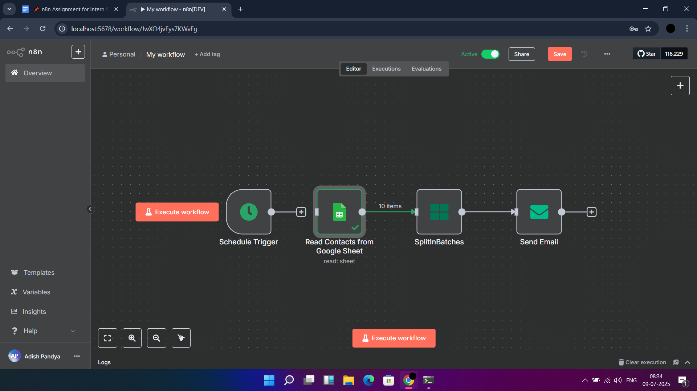

# n8n Email Automation with Google Sheets 📧

This n8n workflow reads contact data from a Google Sheet and sends **personalized emails** to each person using dynamic variables like Name, Company, and a Custom Message.

## 🔄 How It Works

1. **Schedule Trigger** – Starts the workflow manually or on a schedule.
2. **Google Sheets Node** – Reads data from a sheet with columns: `Name`, `Email`, `Company`, `CustomMessage`.
3. **SplitInBatches Node** – Loops through each row (contact).
4. **Send Email Node** – Sends a customized email to each user using template variables.

## 📸 Workflow Screenshot

## ✉️ Example Email Output

**Subject:**  
Welcome to `{{ $json["Company"] }}`, `{{ $json["Name"] }}`!

**Body:**  
Hi `{{ $json["Name"] }}` 👋,

We're excited to welcome you to **{{ $json["Company"] }}**!  
Let us know if you need any help getting started.

Cheers,  
The Team
 

## 📄 Submission Items

- `workflow.json` – Exported n8n workflow
- `screenshot.png` – Canvas screenshot of workflow
- [Google Sheet Template (View only)](https://docs.google.com/spreadsheets/d/1uKPGf-dZyEA0kbkByrGG0Kl9BDJRvOhWi1W7yHgZr4Y/edit?usp=sharing)

---

✅ Built with 💙 by [Adish Pandya](https://github.com/Adish7Pandya)